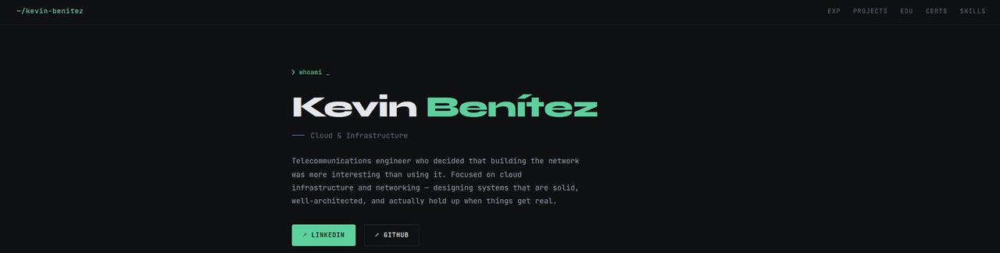
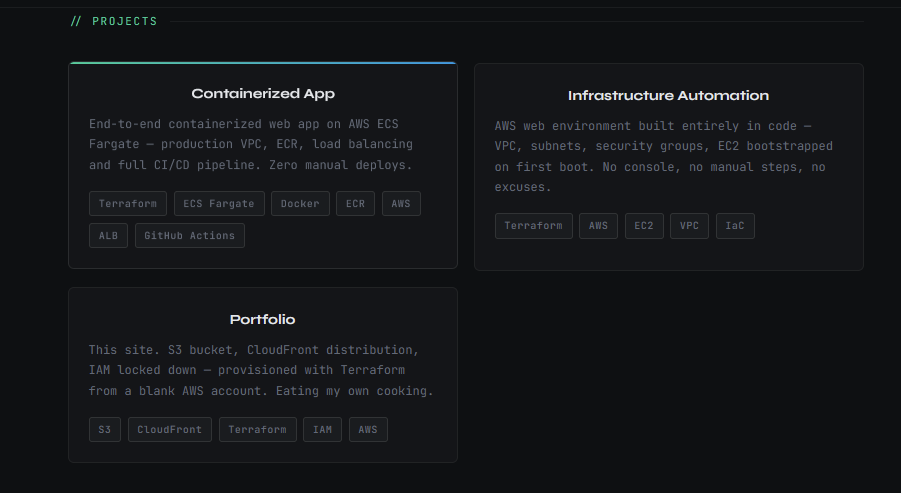
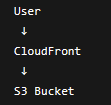

# AWS Static Portfolio Website

A personal portfolio website hosted on AWS using a serverless static hosting architecture.

The goal of this project was to gain hands-on experience with cloud infrastructure, Infrastructure as Code and content delivery services while building a real website that can be publicly deployed.

---

## Architecture

```text
User
  ↓
CloudFront
  ↓
S3 Bucket
```

The website is stored in Amazon S3 and delivered through CloudFront over HTTPS.

CloudFront acts as the public entry point and securely accesses the bucket through Origin Access Control (OAC).

---

## Technologies Used

* AWS S3
* AWS CloudFront
* AWS IAM
* Terraform
* HTML
* CSS

---

## Features

* Static website hosting
* HTTPS delivery through CloudFront
* Private S3 bucket
* Origin Access Control (OAC)
* Infrastructure managed with Terraform
* IAM-based access control

---

## Project Structure

```text
website/
terraform/
screenshots/
```

The website files are separated from the infrastructure code to keep the project organized and easy to maintain.

---

## Screenshots

### Homepage



### Projects Section



### Architecture



---

## What I Learned

This project helped me understand:

* Static website hosting in AWS
* Content delivery using CloudFront
* HTTPS configuration
* Infrastructure as Code with Terraform
* IAM users and policies
* Secure access to S3 using OAC

---

## Future Improvements

* Custom domain using Route 53
* Automated deployments through GitHub Actions
* Additional Terraform modules
* Expanded portfolio content
